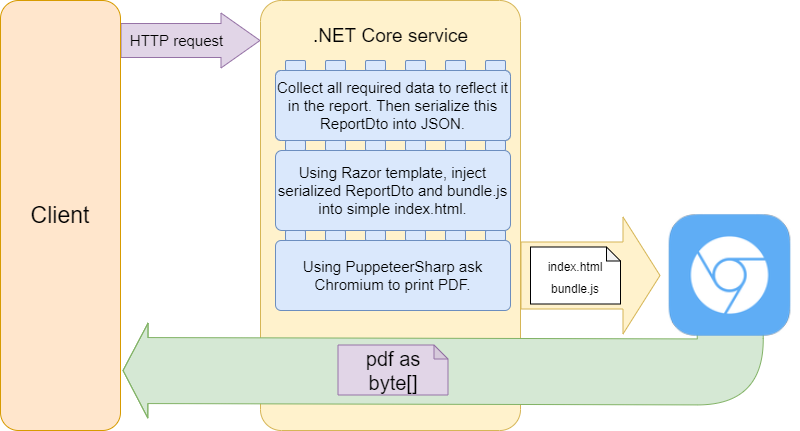

# Pdf generator service with PuppeteerSharp

Hi! Welcome to the example of generating PDFs using PuppeteerSharp.

## Small overview scheme



## How to build and run

1. Firstly, you should open NodeApp folder and build bundle.js. This bundle is used like template for a report, which will be filled with a data from ReportDto. 

```cmd
cd src/MccSoft.PdfGenerator.NodeApp
npm install
npm run build
```

For development mode, use `npm run start` script. It'll be started in browser with HTR.

1. Then open .NET solution from repo's root folder and build it.

1. Run `MccSoft.PdfGenerator.App` service.

1. To get some generated pdf as result, you can use [VSCode](https://code.visualstudio.com/) with installed [HttpClient](https://marketplace.visualstudio.com/items?itemName=humao.rest-client) extension.

    1. Open in VSCode `client.http` file from the repo's root folder.

    1. CLick `Send request`.

    1. After success response, you can click button `Save requst body` and just save it in PDF.

    1. Open saved PDF in some PDF viewer (e.g. Google Chrome).
